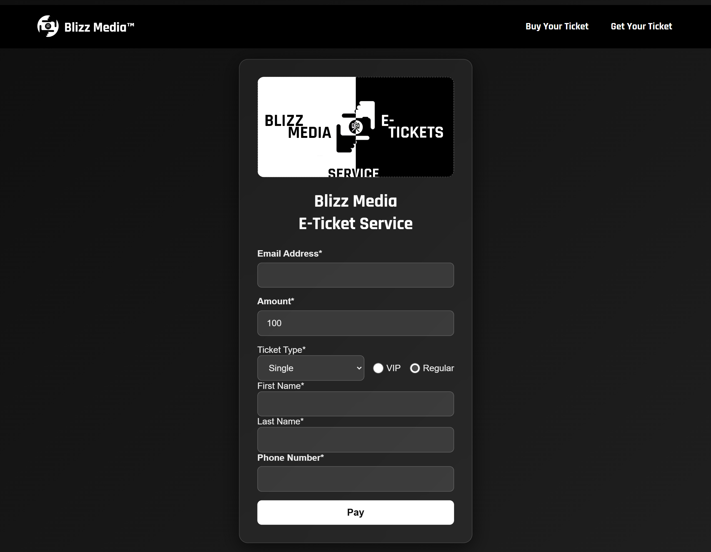
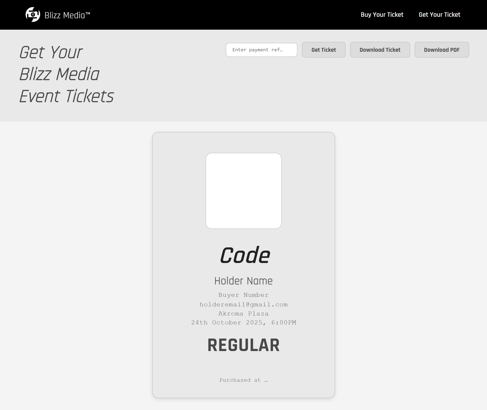
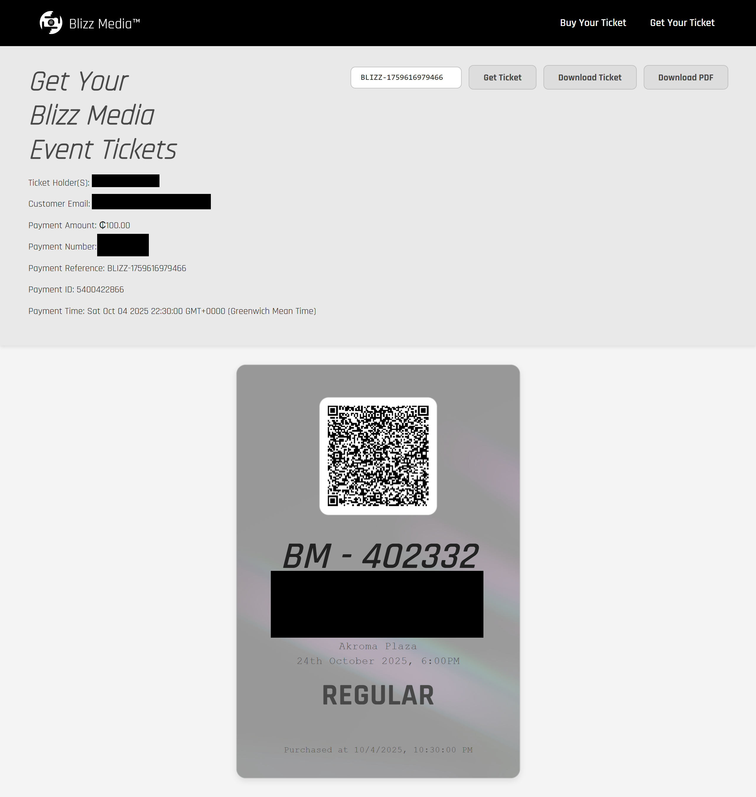
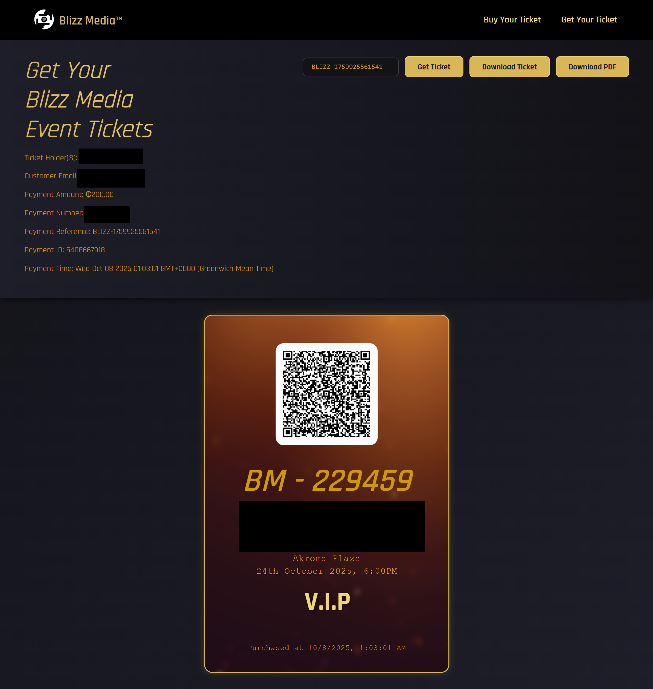
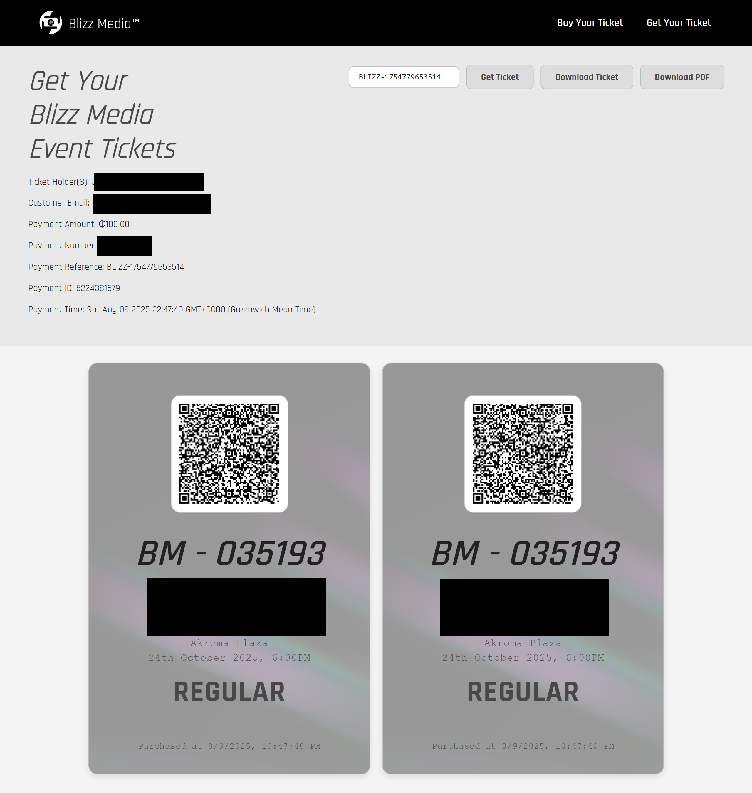
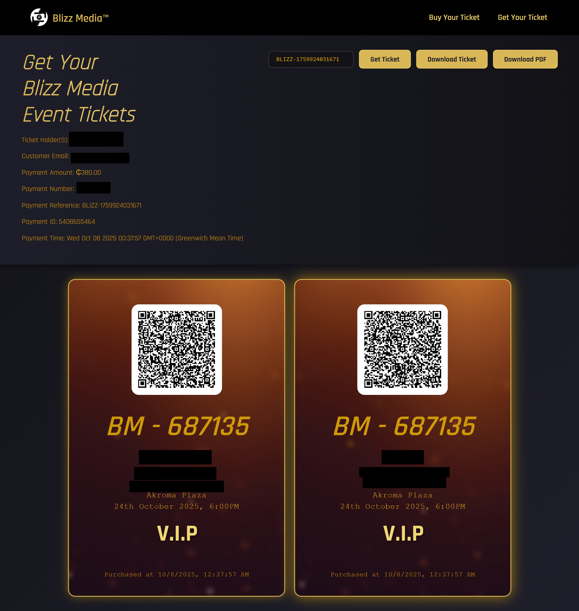

## Blizz Media Ticket Site

A fully functional ticket sales solution built with HTML, CSS and JavaScript.
This project consits of two **websites**  that allows to users to [purchase](https://blizzticky-buy.web.app/) and [view](https://blizzticky-getyours.netlify.app/) Blizz Media Event Tickets

---
## Features 
- Purchase Blizz Media Event tickets
- Paystack integration for payment verification
- View purchased tickets instantly
- Cryptographically signed ticket QR codes for identification
---
## Screenshots
### Website 1 - [blizzticky-buy.web.app](https://blizzticky-buy.web.app/) (Purchasing Website)

---
### Website 2 - [blizzticky-getyours.netlify.app](https://blizzticky-buy.web.app/) (Viewing Website)
[^1] 
[^2]
[^3]
[^4]
[^5]
[^1]: Ticket Place Holder
[^2]: Single Ticket Purchase (Regular)
[^3]: Single Ticket Purchase (VIP)
[^4]: Couple Ticket Purchase(Regular)
[^5]: Couple Ticket Purchase(VIP)
---
## Stack used
- HTML5
- CSS
- JavaScript
- Paystack
- Firebase (Hosting and Database)
- Netlify (Hosting)

